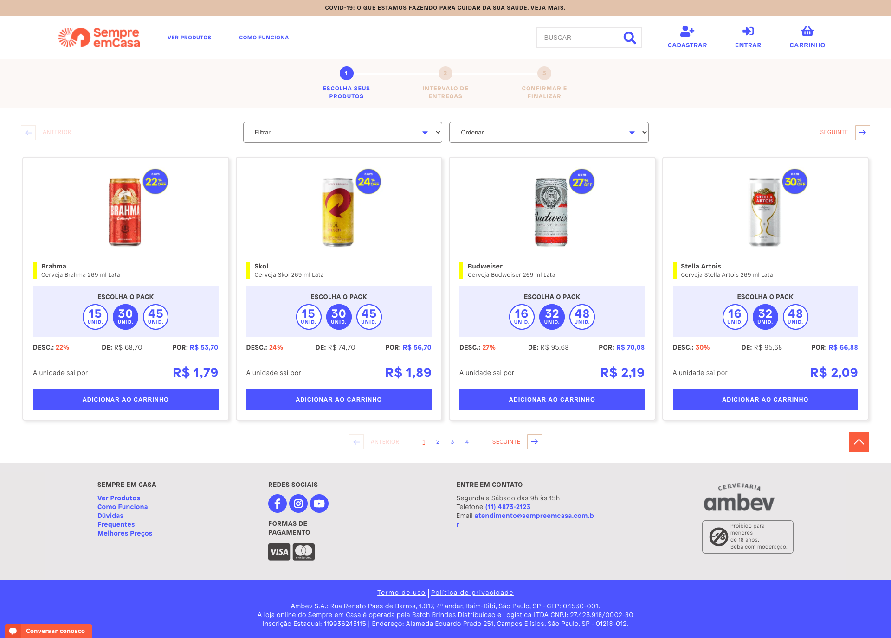

# Frontend Challenge
The objective of this challenge is to build a catalog page for some products of Sempre em Casa.

## Rules
- The page can't be static. It needs some logic to show all products dynamically.
- All products from [products.json](files/products.json) must be shown.
- You need to use React or Next from scratch without using create-react-app and don't forget to add instructions on how to run the project.
- Do not ask your friends to solve the challenge for you. You'll need to explain your choices in person.
- Do not use component frameworks as Bootstrap, Material UI and so on. (We want to see your skills on component creation :D)

## Requirements
- The app must be responsive. Use a **mobile-first** approach.
- For each item on the catalog, the following information must be present on the page:
    - Image
    - Name
    - Price
    - Comparison Price
    - Discount (  % discount we offer using Comparison Price as parameter)
    - Available Pack Sizes
    - If discount > 15% then show a discount badge on product
- It must be possible to add products by size to the cart.
- It must be possible to view the cart with the items you've added (name, image, price, quantity) and the grand total.
- The cart should be persisted between reloads.

Below, you can give a look on how these products are list now, but don't get caught up in it, use your creativity:

## Bonus points
- Easy? So add more functionality to cart allowing users to add, remove and change quantity of cart items.
- Want more challenges? Add a search box and/or filter by brand from [brands.json](files/brands.json).
- Test your application and components, it will be a big bonus point.

## What we will evaluate
- Your code will be evaluated by: semantics, structure, legibility, size, among other factors.
- The `git` history will be evaluated.
- Our stack here is React, Next.js and Redux so using the same stack will make a difference.
- We're looking for a front-end developer who knows how to build layouts and knows a lot about JavaScript. Use this as an opportunity to show us how good you are on both areas.
- Do not forget to document the process needed to run and build your app.

## Got questions?
- The challenge is harder than you anticipated? Would you like to show your experience with something else? Contact us by opening an _issue_.

## How to deliver it
Please, use Github to host your code and add @ze-engineering-code-challenge as a collaborator for it. This Github account (@ze-engineering-code-challenge) is solely used by Zé's engineers to download your code and review it

Good luck!
